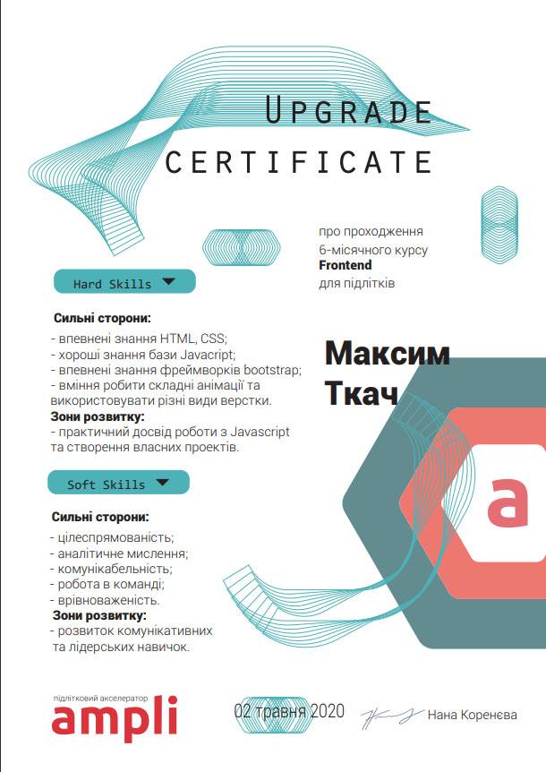

<!-- ✨ ようこそ Max's GitHub Garden へ 🌸 -->

<p align="center">
  
</p>

<p align="center">
  
</p>

---

## 🛠️ 技術スキル / Skills

<p align="center">
  
</p>

---

## 🧠 今学んでいること / Learning Now

- 🌿 REST API with Next.js
- 🎨 Tailwind animations + motion
- 🔧 Design systems in TypeScript
- 🧘‍♂️ UI минимализм в японском стиле

---

## 🌸 デザインと証明書 / Certificates

<div align="center">
  
  
  
</div>

---

## 📈 GitHub Stats — Zen Mode

<p align="center">
  
  
</p>

---

## 🌐 Social / 連絡先

<p align="center">
  <a href="https://www.instagram.com/maxtkach4/?hl=ru">
    
  </a>
  <a href="https://t.me/maxtkach4422">
    
  </a>
</p>

---

## 🧘‍♂️ Zen Corner

```txt
静けさの中に創造が生まれる。
In stillness, creativity blooms.
