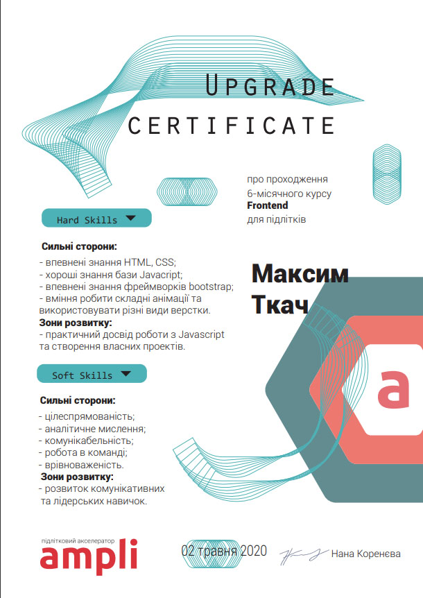

# 
👨‍💻 Макс Ткач | Разработчик

  

  

    
  

  

    <em>「Сосредоточься на прогрессе, а не на совершенстве」</em>
  

  
  
  

 

  

## 🧠 Моя Философия

  

    <strong>Кайдзен — </strong>путь постоянного совершенствования. Каждый день делай маленький шаг вперед, и со временем эти шаги приведут к большим переменам.
  

  

## 💻 Технологии

  
  
  
  
  
  
  

  

## 📦 Проекты

  
  <h3>Begrateful App ✨</h3>
  
Приложение для практики благодарности и развития позитивного мышления.

  <h3>Courtside 🏀</h3>
  
Платформа для поиска спортивных площадок в вашем районе.

  <h3>Freelance Agency 🚀</h3>
  
Агентство по разработке JavaScript и React Native приложений.

  

## 📜 Сертификаты

  
  &nbsp;&nbsp;&nbsp;
  
  &nbsp;&nbsp;&nbsp;
  

  <b>Full Stack Developer</b> &nbsp;&nbsp;&nbsp;&nbsp;&nbsp;&nbsp;&nbsp;&nbsp;&nbsp;&nbsp;&nbsp;&nbsp;&nbsp;&nbsp;&nbsp;&nbsp;&nbsp;&nbsp;&nbsp;&nbsp; <b>UI/UX Design</b> &nbsp;&nbsp;&nbsp;&nbsp;&nbsp;&nbsp;&nbsp;&nbsp;&nbsp;&nbsp;&nbsp;&nbsp;&nbsp;&nbsp;&nbsp;&nbsp;&nbsp;&nbsp;&nbsp;&nbsp; <b>React Advanced</b>

  

## 📊 GitHub статистика

  
    
  
  
    
  
  

  

## 🏆 Достижения

  

  
  
   
  
  

